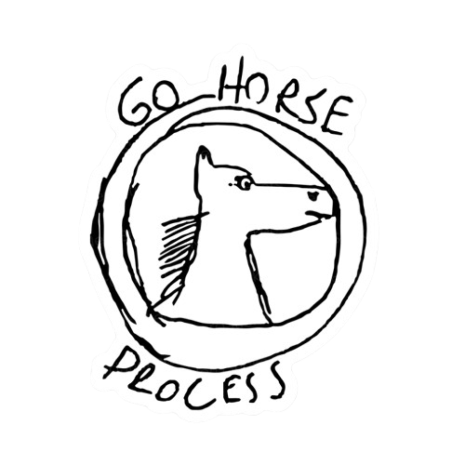

# 脛骨 - Jinggu

_A simple, yet exciting, 2D multiplayer game bedrock made using only **typescript**, **HTML canvas**, **socket.io**, and some infinite loops_

[Overview](#overview) •
[Features](#features) •
[Setup](#setup)

##  Overview

This project encompasses four key services:

- **Sprite Editor**, responsible for mapping images to entities and imparting meaning and responsibilities;
- **Map Editor**, streamlining the construction of larger maps using the designated sprites;
- **Server**, overseeing all interactions and supplying the client with vital information;
- **Client**, consistently rendering the application's state and managing user inputs.

##  Features

This game boasts a vast universe of possibilities, with its expansion contingent solely on the investment of time and effort. Already achieved high-level milestones include:

- Dynamic map drawing, adjusting according to the player's relative position;
- Fluid animated player movement;
- Real-time chat and interactive features;
- Distinguishing walkable and non-walkable tiles.

##  Setup

To run it locally you will need to follow these steps:

- duplicate the file `.env-sample` from the client folder and rename it to `.env`
- at the root folder, execute `npm install`
- run `npm start`

Have fun!

